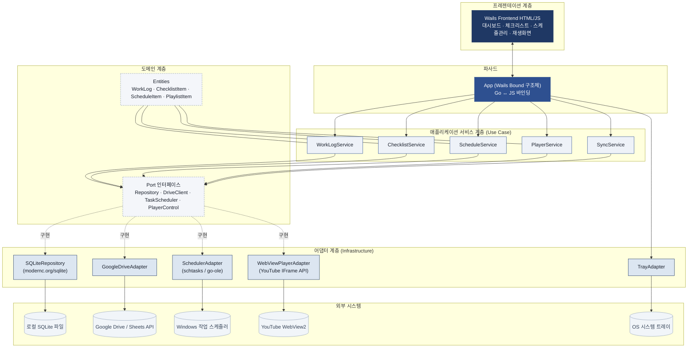
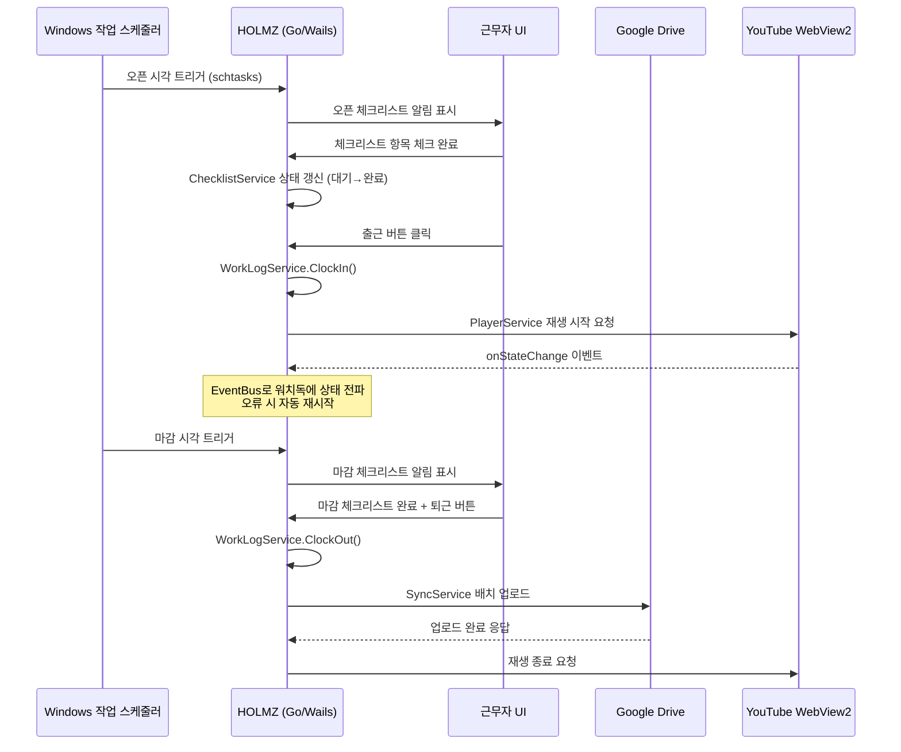

# HOLMZ 근로 종합 관리 프로그램

**기획서 + 아키텍처 설계 (Ver 0.2 — Go 기술 스택 확정판)**

- 작성일: 2026-08-18
- 대상 OS: Windows 10 / 11 (Go 기반 단일 실행 파일(exe) 배포)
- 문서 상태: 초안 (Draft) — 개발 착수 전 검토용

## 목차

1. [문서 개요](#1-문서-개요)
2. [프로젝트 개요](#2-프로젝트-개요)
3. [주요 기능 정의](#3-주요-기능-정의)
4. [시스템 구성 (개념도)](#4-시스템-구성-개념도)
5. [화면(UI) 구성 기획](#5-화면ui-구성-기획)
6. [데이터 모델](#6-데이터-모델)
7. [기술 스택 제안](#7-기술-스택-제안)
8. [핵심 업무 프로세스 플로우](#8-핵심-업무-프로세스-플로우)
9. [비기능 요구사항](#9-비기능-요구사항)
10. [개발 로드맵 (예시)](#10-개발-로드맵-예시)
11. [리스크 및 고려사항](#11-리스크-및-고려사항)
12. [향후 확장 아이디어](#12-향후-확장-아이디어)
13. [소프트웨어 아키텍처](#13-소프트웨어-아키텍처)

---

## 1. 문서 개요

### 1.1 목적

본 문서는 매장/카페 운영 현장에서 반복적으로 발생하는 근로 기록, 업무 자동화 스케줄 등록, 매장 영상 송출, 오픈·마감 점검 업무를 하나의 Windows 데스크톱 프로그램으로 통합 관리하기 위한 "HOLMZ 근로 종합 관리 프로그램"의 기획 내용을 정의한다.

### 1.2 문서 범위

본 문서는 프로그램의 기능 정의, 사용자 시나리오, 화면(UI) 구성, 데이터 모델, 기술 스택 제안, 개발 로드맵, 리스크, 향후 확장 방향, 소프트웨어 아키텍처를 포함한다. 상세 UI 디자인 시안, 화면 단위 와이어프레임, 실제 소스 코드는 본 문서의 범위에 포함하지 않으며, 다음 단계(상세 설계)에서 별도로 진행한다.

### 1.3 용어 정의

| 용어 | 정의 |
|---|---|
| 근로기록(WorkLog) | 근무자의 출근·퇴근 시각 및 근무 중 수행 업무 내역 기록 |
| 오픈/마감 체크리스트 | 매장 영업 시작(오픈) 및 종료(마감) 시 수행해야 할 점검 항목의 목록과 완료 기록 |
| 작업 스케줄 | Windows 작업 스케줄러(Task Scheduler)에 등록되어 지정 시각에 자동 실행되는 작업 |
| 워치독(Watchdog) | 영상 재생 등 특정 프로세스의 비정상 종료를 감지하고 자동으로 복구·재시작하는 감시 기능 |

## 2. 프로젝트 개요

### 2.1 배경 및 목적

매장·카페 운영 시 오픈·마감 절차, 직원 근로기록, 매장 내 영상(홍보 영상, 배경 영상 등) 송출, 반복 업무 자동화는 각각 수기 체크리스트, 엑셀, 별도의 영상 재생 프로그램 등 분리된 도구로 관리되는 경우가 많아 운영자의 관리 부담이 크고 데이터가 흩어져 이력 관리가 어렵다.

HOLMZ는 이 4가지 업무를 하나의 Windows 데스크톱 프로그램으로 통합하여, 매장 운영자의 관리 부담을 줄이고 근로 기록의 신뢰성과 접근성을 높이는 것을 목표로 한다.

### 2.2 대상 사용자

| 구분 | 역할 |
|---|---|
| 관리자 (점주/매니저) | 전체 설정 관리, 체크리스트 항목 등록·수정, 근로기록 조회, 작업 스케줄 등록, 재생목록 관리 |
| 근무자 (직원/아르바이트) | 출퇴근 및 업무 내용 기록, 오픈·마감 체크리스트 작성 |

### 2.3 운영 환경

- 운영체제: Windows 10 / 11 (64bit)
- 형태: 단일 실행 파일(exe) 데스크톱 애플리케이션 — 별도 설치 과정 없이 실행 가능, 상시 실행 및 시스템 트레이 상주
- 네트워크: 인터넷 연결 필수 (Google Drive 연동, YouTube 영상 재생)
- 계정 연동: Google 계정 OAuth 2.0 인증
- 설치 대상 PC: 매장 내 상시 운영 PC (POS 겸용 또는 별도 관리용 PC) 1대 기준

## 3. 주요 기능 정의

본 프로그램의 핵심 기능은 다음 4가지로 구성된다.

| No | 기능 | 한 줄 설명 |
|---|---|---|
| 1 | 근로 업무 구글 드라이브 기록 | 출퇴근·업무 내역을 Google Drive에 자동 기록·백업 |
| 2 | Windows 작업 스케줄 등록 및 관리 | 오픈·마감 시각에 맞춘 자동 실행 작업을 OS 스케줄러에 등록 |
| 3 | YouTube 영상 24시간 재생 | 매장 화면에 지정 영상을 끊김 없이 반복 재생 |
| 4 | 근로 오픈·마감 체크리스트 작성 | 오픈·마감 점검 항목을 체크하고 이력을 기록 |

### 3.1 근로 업무 구글 드라이브 기록

**기능 설명**

근무자의 출퇴근 시각과 근무 중 수행 업무 내역을 프로그램에서 입력하면, 이를 Google Drive(스프레드시트)에 자동으로 저장·누적하는 기능이다.

**세부 요구사항**

- Google 계정 OAuth 2.0 인증을 통한 Drive/Sheets API 연동
- 근무자별 출근/퇴근 시각 기록 (버튼 클릭 방식)
- 근무 중 수행 업무를 자유 입력 또는 사전 정의된 업무 태그로 기록
- 일자별 스프레드시트를 매장 지정 Drive 폴더에 자동 생성·정리
- 오프라인 상태에서는 로컬(SQLite)에 임시 저장 후, 온라인 복귀 시 자동 동기화
- 관리자용 근로기록 조회 화면 제공 (직원별·기간별 필터)

**데이터 항목 예시**

| 필드 | 설명 |
|---|---|
| 날짜 | 근무 일자 |
| 직원명 | 근무자 식별 정보 |
| 출근시각 / 퇴근시각 | 버튼 클릭 시점 자동 기록 |
| 총 근무시간 | 출·퇴근 시각으로 자동 계산 |
| 업무내용 | 근무 중 수행 업무 텍스트 기록 |
| 동기화 상태 | Drive 업로드 완료 여부 |

**사용자 시나리오**

1. 근무자가 출근 시 프로그램에서 "출근" 버튼 클릭 → 시각 자동 기록
2. 근무 중 수행한 업무를 자유 입력 또는 태그로 기록
3. 퇴근 시 "퇴근" 버튼 클릭 → 총 근무시간 자동 계산
4. 하루 마감 시 해당 일자 데이터가 Google Drive 지정 폴더의 스프레드시트에 자동 업로드

### 3.2 Windows 작업 스케줄 등록 및 관리

**기능 설명**

프로그램 내 화면에서 Windows 작업 스케줄러(Task Scheduler)에 반복 작업을 등록·수정·삭제할 수 있는 기능이다. 매장 오픈·마감 시각에 맞춰 체크리스트 알림, 영상 재생 시작·종료, 근로기록 자동 업로드 등을 자동 실행한다.

**세부 요구사항**

- 프로그램 GUI에서 스케줄 항목 등록 (작업명, 실행 시각, 반복 주기(요일), 실행할 동작 선택)
- 내부적으로 schtasks 명령어 또는 Task Scheduler COM API(win32com)를 통해 실제 OS 스케줄에 등록
- 등록된 스케줄 목록 조회·수정·일시중지·삭제 기능
- 대표 자동화 템플릿 제공: "오픈 시각 - 체크리스트 알림 + 영상 재생 시작", "마감 시각 - 체크리스트 알림 + 근로기록 업로드 + 영상 재생 종료"
- 관리자 권한이 필요한 작업에 대한 안내 및 UAC 권한 요청 처리
- PC 절전 모드 중에도 예약 작업이 정상 동작하도록 "깨우기" 옵션 반영

**사용자 시나리오**

1. 관리자가 오픈 시각(예 09:00)과 마감 시각(예 22:00)을 등록
2. 프로그램이 Windows 작업 스케줄러에 해당 시각의 트리거를 자동 등록
3. 매일 09:00에 오픈 체크리스트 알림 및 영상 재생이 자동 실행됨
4. 매일 22:00에 마감 체크리스트 알림, 근로기록 자동 업로드, 영상 재생 종료가 자동 실행됨

### 3.3 YouTube 영상 24시간 재생

**기능 설명**

매장 운영 시간(또는 24시간) 동안 지정된 YouTube 영상·재생목록을 매장 내 화면(모니터/TV)에서 끊김 없이 반복 재생하는 기능이다.

**세부 요구사항**

- 재생할 YouTube 영상 URL 또는 재생목록 등록 기능
- 프로그램 내장 재생 화면(웹뷰 기반) 제공, 전체화면 모드 지원
- 네트워크 단절, 영상 오류 등 예외 상황을 감지해 자동 재시작하는 워치독 기능
- 3.2 작업 스케줄과 연동: 오픈 시각에 자동 재생 시작, 마감 시각에 자동 종료
- 음소거·음량 조절, 재생목록 순환 재생, 다음 영상 자동 전환 옵션
- 저작권 및 YouTube 이용약관 관련 주의사항 확인 (11장 리스크 참고)

**사용자 시나리오**

1. 관리자가 매장에서 재생할 YouTube 재생목록 URL을 등록
2. 오픈 시각이 되면 스케줄러에 의해 프로그램이 자동으로 재생목록을 전체화면 재생 시작
3. 재생 중 오류 발생 시 워치독이 자동 감지 후 재생 재시작
4. 마감 시각이 되면 재생이 자동 종료되거나 대기화면으로 전환

### 3.4 근로 오픈 및 마감 체크리스트 작성

**기능 설명**

매장 오픈·마감 시 수행해야 하는 업무 항목을 체크리스트로 제공하고, 근무자가 항목별 완료 여부를 표시·기록하는 기능이다.

**세부 요구사항**

- 관리자가 오픈용/마감용 체크리스트 항목을 자유롭게 등록·수정 (항목명, 순서, 필수 여부)
- 근무자는 프로그램 실행 시 당일 오픈/마감 체크리스트를 확인하고 항목별로 체크
- 항목별 사진 첨부(선택) 기능 — 예: 청소 상태, 재고 확인 사진
- 체크리스트 완료 시각 및 작성자(근무자) 자동 기록
- 필수 항목 미완료 시 마감 처리 제한 또는 경고 알림
- 완료된 체크리스트 내역은 3.1의 근로기록과 함께 Google Drive에 저장되어 이력 관리
- 관리자용 체크리스트 이력 조회 화면 (날짜별·직원별 완료 현황)

**체크리스트 항목 예시**

| 구분 | 항목 | 필수 여부 |
|---|---|---|
| 오픈 | 매장 조명·간판 점등 | 필수 |
| 오픈 | 냉장고·냉동고 온도 확인 | 필수 |
| 오픈 | POS 시스템 부팅 및 시재 확인 | 필수 |
| 오픈 | 원두·재료 등 재고 확인 | 필수 |
| 오픈 | 테이블·의자 정리 | 선택 |
| 오픈 | 매장 영상(유튜브) 재생 확인 | 선택 |
| 마감 | 매장 조명·간판 소등 | 필수 |
| 마감 | 주방 기기 전원 차단 | 필수 |
| 마감 | 바닥·테이블·주방 청소 | 필수 |
| 마감 | 시재 마감 및 매출 정산 | 필수 |
| 마감 | 쓰레기 배출 | 선택 |
| 마감 | 출입문 잠금 확인 | 필수 |

> ※ 위 항목은 예시이며, 실제 운영 매장의 업무 절차에 맞춰 관리자가 자유롭게 추가·수정할 수 있어야 한다.

**사용자 시나리오**

1. 오픈 담당 근무자가 출근 후 프로그램 실행 → 당일 오픈 체크리스트 표시
2. 항목을 순서대로 확인하며 체크, 필요 시 사진 첨부
3. 필수 항목 체크 완료 시 "오픈 완료" 처리 및 완료 시각 기록
4. 마감 시에도 동일한 방식으로 마감 체크리스트 수행 후 "마감 완료" 처리, 데이터는 자동으로 Drive에 백업

## 4. 시스템 구성 (개념도)

프로그램은 아래와 같이 UI 계층, 애플리케이션 로직 계층, 로컬 저장소, 외부 연동, OS 연동으로 구성된다.

| 계층 | 구성 요소 | 설명 |
|---|---|---|
| 사용자 인터페이스 | 대시보드 / 체크리스트 / 근로기록 / 스케줄 관리 / 영상 재생 / 설정 화면 | 관리자·근무자용 데스크톱 GUI |
| 애플리케이션 로직 | 근로기록 처리, 체크리스트 처리, 스케줄 관리, 재생 제어 모듈 | 각 기능별 비즈니스 로직 처리 |
| 로컬 저장소 | SQLite | 오프라인 캐시 및 임시 저장, 동기화 전 대기 큐 |
| 외부 연동 | Google Drive/Sheets API, YouTube 웹뷰(IFrame Player API) | 클라우드 저장 및 영상 재생 연동 |
| OS 연동 | Windows 작업 스케줄러, 시스템 트레이, 알림 | 자동 실행 및 상시 상주 |

## 5. 화면(UI) 구성 기획

| 화면명 | 주요 구성 요소 | 접근 권한 |
|---|---|---|
| 대시보드 | 오늘 근무 현황, 오픈/마감 상태, 영상 재생 상태 요약, 빠른 실행 버튼 | 관리자 / 근무자 |
| 근로기록 화면 | 출퇴근 버튼, 업무 입력창, 개인 근로 이력 | 근무자 |
| 근로기록 관리 | 직원별·기간별 근로기록 조회, Drive 링크 바로가기 | 관리자 |
| 체크리스트 화면 | 오픈/마감 항목 리스트, 체크박스, 사진 첨부, 완료 버튼 | 근무자 |
| 체크리스트 관리 | 항목 추가·수정·삭제, 순서 변경 | 관리자 |
| 스케줄 관리 화면 | 스케줄 목록, 등록·수정·삭제, 자동화 템플릿 선택 | 관리자 |
| 영상 재생 화면 | 전체화면 플레이어, 재생목록 관리, 음량 조절 | 관리자 |
| 설정 화면 | Google 계정 연동, 매장 정보, 알림 설정, 직원 계정 관리 | 관리자 |

## 6. 데이터 모델

### 6.1 근로기록 (WorkLog)

| 필드 | 타입 | 설명 |
|---|---|---|
| date | Date | 근무 일자 |
| employee_id / name | String | 근무자 식별 정보 |
| clock_in / clock_out | DateTime | 출근·퇴근 시각 |
| total_hours | Number | 총 근무시간 (자동 계산) |
| task_notes | Text | 근무 중 수행 업무 내용 |
| sync_status | String | Drive 동기화 완료 여부 |

### 6.2 체크리스트 (Checklist)

| 필드 | 타입 | 설명 |
|---|---|---|
| date | Date | 점검 일자 |
| type | String | 오픈 / 마감 구분 |
| item_id / item_name | String | 체크리스트 항목 |
| is_required | Boolean | 필수 여부 |
| is_checked / checked_at | Boolean / DateTime | 완료 여부 및 완료 시각 |
| checked_by | String | 작성(체크)한 근무자 |
| photo_url | String | 첨부 사진 (선택) |

### 6.3 스케줄 (Schedule)

| 필드 | 타입 | 설명 |
|---|---|---|
| schedule_id | String | 스케줄 식별자 |
| task_name | String | 작업명 |
| run_time | Time | 실행 시각 |
| repeat_days | String[] | 반복 요일 |
| action_type | String | 체크리스트 알림 / 영상 재생 시작·종료 / 근로기록 업로드 |
| is_active | Boolean | 활성화 여부 |

### 6.4 재생목록 (PlaylistItem)

| 필드 | 타입 | 설명 |
|---|---|---|
| order | Number | 재생 순번 |
| title | String | 영상 제목 |
| video_url / video_id | String | YouTube 영상 URL 또는 ID |
| is_active | Boolean | 재생목록 포함 여부 |

## 7. 기술 스택 제안

"단일 실행 파일(exe) 배포" 요구사항을 반영하여 Go 언어 기반 스택으로 확정한다. Go는 컴파일 시 OS·아키텍처별 단일 바이너리를 생성하므로, 별도 런타임 설치 없이 exe 파일 하나로 배포하는 목표에 가장 부합한다.

| 영역 | 제안 기술 | 비고 |
|---|---|---|
| 데스크톱 GUI / 웹뷰 | Go + Wails v2 (Windows WebView2 기반) | OS 내장 WebView2 렌더링 엔진을 사용해 Electron 대비 결과물 용량이 크게 작음 |
| YouTube 재생 | WebView2 내 YouTube IFrame Player API 로드 (Go net/http로 로컬 wrapper 페이지 서빙) | Wails의 Go↔JS 바인딩으로 재생 상태 이벤트를 받아 워치독(자동 재시작) 구현 |
| Google 연동 | golang.org/x/oauth2/google, google.golang.org/api (drive/v3, sheets/v4) | 공식 Go 클라이언트, OAuth 2.0 인증 |
| 로컬 DB | modernc.org/sqlite (Pure Go, CGO 불필요) | CGO 기반 드라이버 대신 Pure Go 드라이버를 사용해야 단일 바이너리·크로스컴파일이 안정적 |
| Windows 스케줄러 연동 | os/exec으로 schtasks.exe 호출, 또는 go-ole로 Task Scheduler COM API 직접 제어 | 후자가 조회·수정 등 더 정교한 제어 가능 |
| 백그라운드 상주 | Wails v2 내장 시스템 트레이 기능 또는 getlantern/systray | 시스템 트레이 아이콘 및 상시 실행 |
| 정적 리소스 번들링 | go:embed | 프론트엔드(HTML/CSS/JS)·아이콘 등을 컴파일 시점에 실행 파일에 포함 |
| 빌드/배포 | go build (CGO_ENABLED=0) → 단일 exe | 설치 마법사 없이 exe 직접 배포가 기본 전략 |
| 버전관리 | Git + GitHub(또는 사내 저장소) | 릴리즈 노트 관리 |

### 7.1 단일 exe 배포 전략

- go:embed 디렉티브로 프론트엔드 정적 자산(HTML/JS/CSS, 아이콘)을 소스에 포함시켜, 별도 리소스 폴더 없이 실행 파일 하나로 컴파일한다.
- CGO_ENABLED=0으로 빌드해 외부 DLL 의존성을 제거한다. 이를 위해 SQLite도 CGO 기반 드라이버(mattn/go-sqlite3) 대신 Pure Go 드라이버(modernc.org/sqlite)를 사용한다.
- 결과물은 수십 MB 수준의 단일 .exe 파일이며, 별도 설치 절차 없이 더블클릭으로 바로 실행 가능하다.
- 단, Windows 작업 스케줄러 등록은 실행 파일 형태와 무관하게 관리자 권한(UAC)이 필요한 OS 정책이므로, exe 매니페스트에 관리자 권한 요청을 내장해 최초 실행 시 권한 승인을 받도록 한다.
- WebView2 런타임 자체는 OS가 아닌 별도 구성요소이므로 완전한 무의존 단일 exe를 원할 경우 추가 고려가 필요하다 (11장 리스크 참고).

## 8. 핵심 업무 프로세스 플로우

하루 운영 기준 표준 흐름은 다음과 같다.

1. [스케줄러] 등록된 오픈 시각 도달 → 프로그램 자동 실행/포그라운드 전환
2. [체크리스트] 오픈 체크리스트 알림 표시 → 근무자가 항목 점검 및 완료 처리
3. [근로기록] 근무자 출근 처리 → 근무 시작 시각 기록
4. [영상재생] 영상 재생 자동 시작 (전체화면, 워치독 감시 시작)
5. (근무 중) 업무 내용 수시 기록
6. [스케줄러] 등록된 마감 시각 도달 → 마감 체크리스트 알림 표시
7. [체크리스트] 근무자가 마감 항목 점검 및 완료 처리
8. [근로기록] 근무자 퇴근 처리 → 근무 종료 시각 및 총 근무시간 계산
9. [동기화] 당일 근로기록·체크리스트 데이터 Google Drive 자동 업로드
10. [영상재생] 영상 재생 자동 종료 또는 대기화면 전환

## 9. 비기능 요구사항

| 구분 | 요구사항 |
|---|---|
| 보안 | OAuth 토큰·계정정보는 Windows Credential Manager 또는 암호화 저장. 근무자별 접근 권한(로그인/PIN)을 분리한다. |
| 안정성 | 영상 재생 크래시·네트워크 단절 시 워치독이 자동 감지 및 재시작(최대 재시도 후 관리자 알림). 오프라인 시 로컬 캐시 후 자동 동기화. |
| 성능 | 상시 상주 시 메모리·CPU 점유를 최소화하고, 유휴 상태에서는 리소스를 절약한다. |
| 로그/모니터링 | 프로그램 동작 로그를 로컬에 저장해 오류를 추적하고, 관리자에게 주요 오류를 알린다. |
| 사용성 | 근무자용 화면은 최소 클릭으로 조작 가능하도록 큰 버튼과 직관적 아이콘 위주로 단순화한다. |
| 다중 사용자 구분 | 직원별 로그인 또는 PIN 입력으로 근로기록 작성자를 식별한다. |

## 10. 개발 로드맵 (예시)

> 아래 일정은 상세 기획 확정 전 참고용 예시이며, 실제 개발 인력·범위에 따라 조정이 필요하다.

| 단계 | 기간(예시) | 주요 내용 | 산출물 |
|---|---|---|---|
| 1단계 | 1~2주차 | 상세 기획 확정, 화면설계(와이어프레임), 데이터모델 확정, Wails 웹뷰·스케줄러 연동 기술검증(PoC) | 상세기획서, 와이어프레임, PoC 결과 |
| 2단계 | 3~5주차 | MVP 개발 — 체크리스트 + 근로기록 (로컬 저장 기준) | MVP 프로그램 |
| 3단계 | 6~7주차 | Google Drive/Sheets 연동 및 자동 동기화 구현 | 연동 모듈 |
| 4단계 | 8~9주차 | Windows 작업 스케줄러 연동 기능 개발 | 스케줄 관리 모듈 |
| 5단계 | 10~11주차 | YouTube 재생 기능 및 워치독(자동 복구) 구현 | 재생 모듈 |
| 6단계 | 12~13주차 | 통합 테스트, 버그 수정, 단일 exe 빌드 및 WebView2 의존성 검증 | 단일 exe 파일, 테스트 리포트 |
| 7단계 | 14주차~ | 매장 시범 운영 및 피드백 반영, 정식 배포 | 정식 버전 v1.0 |

## 11. 리스크 및 고려사항

| 구분 | 내용 | 대응 방안 |
|---|---|---|
| YouTube 이용약관 | 매장에서 유튜브 영상을 상시·반복 재생(특히 상업적 배경영상·음악 목적)하는 것은 YouTube 서비스 약관상 제한될 수 있다. 단순 임베드 재생은 가능하지만, 상업적 이용이나 자동화된 무한 반복재생은 정책 위반 소지가 있다. | 자체 보유·제작 채널의 콘텐츠를 우선 사용하고, 상업 공간용 배경음악·영상은 정식 라이선스가 있는 서비스(예: 매장음악 전용 서비스) 이용을 검토한다. 최종 이용 전 YouTube 약관 및 관련 법률 검토를 권장한다. |
| Google API 쿼터 제한 | Drive/Sheets API의 일일 요청 한도를 초과할 가능성이 있다. | 실시간 저장 대신 배치 업로드 방식을 사용하고, 불필요한 조회를 캐싱으로 최소화한다. |
| Windows 권한 문제 | 작업 스케줄러 등록 시 관리자 권한이 필요할 수 있다. | 최초 설치 시 UAC 권한 안내 화면을 제공하고, 설치 프로그램에서 권한을 사전 요청한다. |
| 네트워크 의존성 | 인터넷 미연결 시 Drive 업로드 및 영상 재생이 불가능하다. | 로컬 캐시 저장 및 재연결 시 자동 재시도 로직을 구현한다. |
| 개인정보 처리 | 근로기록에 근무자의 근무시간 등 개인정보가 포함된다. | 접근 권한을 관리자·본인으로 제한하고, 저장 데이터 암호화 및 보관 기간 정책을 수립한다. |
| WebView2 런타임 의존성 | Wails(Windows)는 OS에 설치된 Microsoft Edge WebView2 Runtime을 사용한다. Windows 10(2022년 이후 업데이트)·Windows 11에는 기본 내장되어 있으나, 구버전이거나 특수 환경의 PC에는 없을 수 있다. | 배포 전 대상 매장 PC의 WebView2 설치 여부를 확인한다. 완전한 무의존 단일 exe가 필요하면 고정 버전 런타임을 함께 포함하는 빌드(용량 약 150~200MB 증가)를 검토하고, 그렇지 않으면 최초 실행 시 자동 설치 부트스트래퍼로 안내한다. |
| Go 데스크톱/웹뷰 생태계 성숙도 | Wails·go-ole 등은 Python(PySide6)·Electron 대비 상대적으로 커뮤니티와 참고 자료가 적은 신생 생태계다. | 본격 개발 전 웹뷰 임베드·작업 스케줄러 연동 등 핵심 기능에 대한 기술 검증(PoC)을 1단계에서 우선 수행하고, 공식 Wails 문서·이슈트래커를 1차 참고 자료로 활용한다. |

## 12. 향후 확장 아이디어

- 다중 매장·다중 지점 관리 (매장별 데이터 분리)
- 근무시간 기반 급여 계산 자동화
- 통계 대시보드 (근무시간 추이, 체크리스트 이행률 시각화)
- 모바일 앱 연동 (근태 알림, 원격 체크리스트 확인)
- 카카오톡·슬랙 등 메신저 알림 연동 (마감 미완료 항목 알림 등)
- 매장 영상·음악 소스 다변화 (자체 콘텐츠, 정식 라이선스 서비스 연동)

## 13. 소프트웨어 아키텍처

전체 아키텍처는 **헥사고날(포트&어댑터) + 계층형** 구조를 따른다. Google Drive, Windows 작업 스케줄러, YouTube WebView2 등 변동성 높은 외부 연동을 어댑터 계층 뒤로 격리하고, 도메인·서비스 계층은 인터페이스(Port)에만 의존하도록 설계한다.

### 13.1 계층 구조



### 13.2 하루 운영 흐름 (시퀀스 다이어그램)



### 13.3 적용 디자인 패턴 요약

| 패턴 | 적용 위치 | 적용 이유 |
|---|---|---|
| Ports & Adapters (Hexagonal) | 전체 아키텍처 | Drive API·스케줄러·WebView2 등 외부 연동을 인터페이스로 격리 → 테스트 시 목(mock)으로 대체, 추후 연동 교체(예: 매장음악 서비스) 용이 |
| Repository | WorkLog / Checklist / Schedule / Playlist 데이터 접근 | SQLite 구현 세부사항을 서비스 계층에서 숨김. 저장소를 바꿔도 서비스 로직 무변경 |
| Adapter | GoogleDriveAdapter, SchedulerAdapter, WebViewPlayerAdapter | 서로 다른 외부 API/OS 인터페이스를 도메인이 이해하는 공통 인터페이스로 변환 |
| Facade | Wails Bound App 구조체 | 프론트엔드(JS)에 노출되는 진입점을 단일화. 내부 서비스 여러 개를 하나의 표면으로 정리 |
| Command | 스케줄러가 실행하는 자동화 액션(체크리스트 알림 / 재생 시작·종료 / 업로드) | 액션을 객체로 캡슐화해 스케줄에 등록 → 새 자동화 액션 추가 시 기존 코드 수정 없이 확장(개방-폐쇄 원칙) |
| Observer / Event Bus | 재생 상태 변화(워치독), 스케줄 트리거 알림 | Go channel 기반으로 "재생 오류 발생" 같은 이벤트를 여러 구독자(UI 알림, 로그, 재시작 로직)에 동시 전파 |
| State Machine | 체크리스트 상태(대기→진행중→완료), 재생 상태(재생중/정지/오류/재시도) | 상태별 허용 전이만 명시적으로 정의 → "필수 항목 미완료 시 마감 제한" 같은 규칙을 상태 전이 조건으로 자연스럽게 구현 |
| Strategy | SyncService의 업로드 정책(즉시 업로드 vs 배치 업로드) | 네트워크 상태나 운영 정책에 따라 동기화 방식을 교체 가능하도록 분리 |

### 13.4 패키지(디렉터리) 구조 예시

```
/cmd/holmz                   - main.go, Wails 앱 부트스트랩
/internal/domain             - 엔티티(WorkLog, ChecklistItem, ScheduleItem, PlaylistItem) + Port 인터페이스
/internal/service             - 애플리케이션 서비스 (WorkLogService, ChecklistService, ScheduleService, PlayerService, SyncService)
/internal/repository/sqlite   - SQLite Repository 구현체 (modernc.org/sqlite)
/internal/adapter/googledrive - Drive/Sheets API 어댑터 (OAuth 포함)
/internal/adapter/scheduler   - Windows 작업 스케줄러 어댑터 (schtasks / go-ole)
/internal/adapter/player      - WebView2 + YouTube IFrame Player 제어, 워치독
/internal/adapter/tray        - 시스템 트레이 어댑터
/internal/eventbus            - 채널 기반 이벤트 버스 (재생 상태, 스케줄 트리거)
/frontend                     - Wails 프론트엔드 자산 (go:embed로 바이너리에 포함)
```

> 위 두 다이어그램은 GitHub, VS Code, Obsidian 등 Mermaid를 지원하는 마크다운 뷰어에서 자동으로 렌더링됩니다. 일반 텍스트 에디터에서는 `mermaid` 코드 블록의 소스 텍스트로 보일 수 있습니다.
